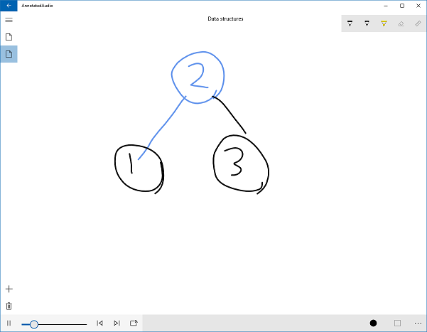

<!--- 
  category: Navigation Data AudioVideoAndCamera NetworkingAndWebServices CustomUserInteractions Inking FilesFoldersAndLibraries 
-->

# Annotated Audio app sample

**Note** - This sample is targeted and tested for Windows 10, version 1903 (10.0; Build 18362), and Visual Studio 2019. If you prefer, you can use project properties to retarget the project(s) to Windows 10, version 1809 (10.0; Build 17763), and/or open the sample with Visual Studio 2017.

A mini-app sample that demonstrates audio, ink, and OneDrive data roaming scenarios. This sample records audio while allowing the synchronized capture of ink annotations so that you can later recall what was being discussed at the time a note was taken. 

When playing recorded audio, ink strokes are highlighted when the recording reaches the time when the strokes were made. Tapping on an ink stroke begins audio playback from the time that stroke was made.

## Features 

This app showcases the following Universal Windows Platform (UWP) features.

- Web Authentication and HttpClient to interface with the OneDrive REST API and enable roaming large amounts of data (images, audio recordings, etc.)
- Windows Ink platform to capture audio annotations and serialize ink strokes for later recall.
- MediaCapture to record audio in segments.
- MediaPlaback and Playlists to playback previously captured audio segments.
- DataCue to associate ink strokes with audio.
- Zip Compression to package audio, ink strokes, and other metadata into a single compressed file.

## Run the sample

You must associate the app sample with the Store before you can run it (see instructions below). 

**Note**: This sample assumes you have an internet connection. Also, the platform target currently defaults to ARM, so be sure to change that to x64 or x86 if you want to test on a non-ARM device.

### Install the correct OS and tools

- Windows 10. Minimum: Windows 10, version 1809 (10.0; Build 17763), also known as the Windows 10 October 2018 Update.
- [Windows 10 SDK](https://developer.microsoft.com/windows/downloads/windows-10-sdk). Minimum: Windows SDK version 10.0.17763.0 (Windows 10, version 1809).
- [Visual Studio 2019](https://visualstudio.microsoft.com/downloads/) (or Visual Studio 2017). You can use the free Visual Studio Community Edition to build and run Windows Universal Platform (UWP) apps.

To get the latest updates to Windows and the development tools, and to help shape their development, join 
the [Windows Insider Program](https://insider.windows.com).

### Associate the app sample with the Store

This sample uses the WebAuthentication APIs that require store association. To associate the app with the Store, right click the project in Visual Studio and select **Store** -> **Associate App with the Store**. Then follow the instructions in the wizard. 

**Important Note** You don't need to submit the app to the Store, just associate it with your account.

## Navigating the sample

This sample uses the MVVM design pattern, where the XAML code binds to several properties and commands. Below is a guide to help you navigate the code.

### View and ViewModel
[SessionPicker.xaml](AnnotatedAudio/View/SessionPicker.xaml#L25) and [SessionPicker.xaml.cs](AnnotatedAudio/View/SessionPicker.xaml.cs#L25)
This page defines the UI for managing user sessions and is bound to the [SessionPickerViewModel](AnnotatedAudio/ViewModel/SessionPickerViewModel.cs#L25).

[SessionViewer.xaml](AnnotatedAudio/View/SessionViewer.xaml#L25) and [SessionViewer.xaml.cs](AnnotatedAudio/View/SessionViewer.xaml.cs#L25). 
This page defines the UI for users to record and playback sessions. It is bound to [SessionViewModel.cs](AnnotatedAudio/ViewModel/SessionViewModel.cs#L25).

### Important feature components
The following classes contain the code for key sample features.
- [AudioRecordingManager.cs](AnnotatedAudio/ViewModel/AudioRecordingManager.cs#L25). This class contains the code that enables audio recording.
- [AudioPlaybackManager.cs](AnnotatedAudio/ViewModel/AudioPlaybackManager.cs#L25). This class conatins the code that enables audio playback, data cues, and playlists.
- [OneDriveManager.cs](AnnotatedAudio/ViewModel/OneDriveManager.cs#L25). This class contains the code that enables web authentication and interaction with OneDrive using the REST API.
- [SessionViewModel.cs](AnnotatedAudio/ViewModel/SessionViewModel.cs#L25). This class is a ViewModel that contains all the core inking functionality.
- [Session.cs](AnnotatedAudio/model/Session.cs#L25). This class is a model that represents a Session and contains core ZIP compression functionality.

### Related documentation
- [Inking](https://docs.microsoft.com/windows/uwp/input-and-devices/pen-and-stylus-interactions)
- [Audio, video, and Camera](https://docs.microsoft.com/windows/uwp/audio-video-camera/)
